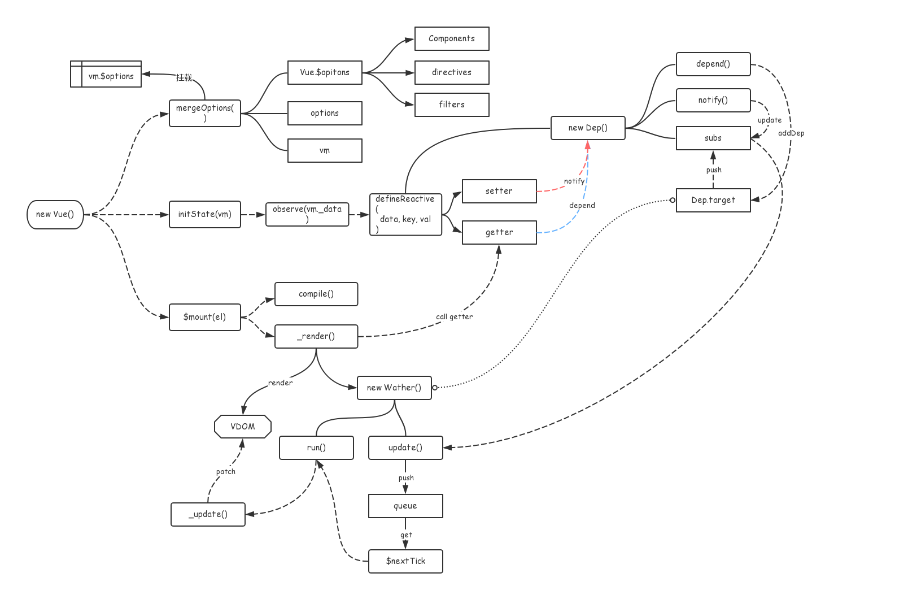

# vue源码解析

> 版本号为: 2.5.17


```
scripts             # 构建相关的文件，一般情况下我们不需要动
├── git-hooks       # 存放git钩子的目录
├── alias.js        # 别名配置
├── config.js       # 生成rollup配置的文件
├── build.js        # 对 config.js 中所有的rollup配置进行构建
├── ci.sh           # 持续集成运行的脚本
├── release.sh      # 用于自动发布新版本的脚本

src                 # vue源代码
├── compiler        # 编译相关，将 template 编译为 render 函数
├── core            # 核心代码 
├── platforms       # 不同平台的支持
├── server          # 服务端渲染
├── sfc             # 单文件组件（.vue 文件）解析，用于vue-template-compiler包
├── shared          # 整个代码库通用的代码
```

## new Vue()

